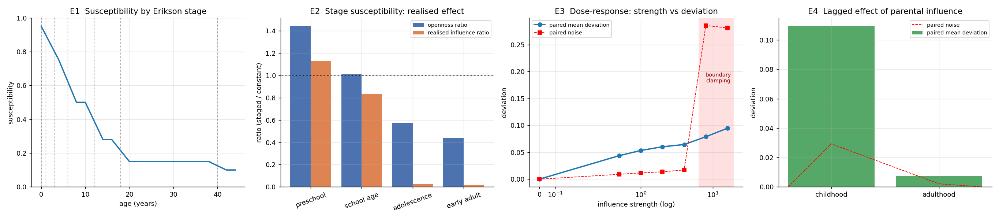
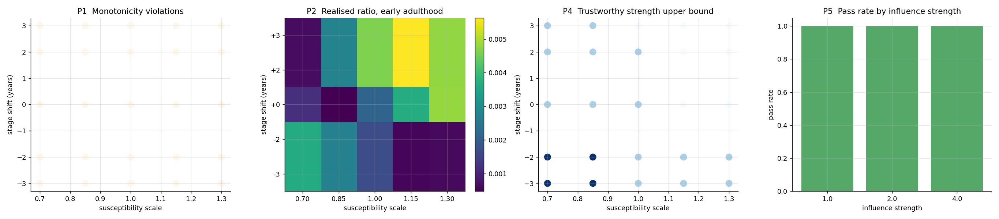

# Family ABM — 家庭社会小生境智能体建模框架

[](https://github.com/C1rcleW/NICHE-sim-demo-/actions/workflows/ci.yml)
[](https://www.python.org/)
[](LICENSE)
[](https://github.com/astral-sh/ruff)

一个模块化、可复用的**智能体建模（Agent-Based Model）框架**，用于模拟家庭社会小生境（Social Micro-Niches）。集成代际影响机制、兰彻斯特型 ODE 拟合、交互式 Web 仪表板，面向计算社会学与交叉科学研究。

**研究问题**：家庭内部的代际影响强度随子代发展阶段系统性下降。这种变化如何影响子代的长期结果？含有时变影响系数的家庭动力学，能否被低维方程刻画？

> 完整的研究设计（理论框架、四项可证伪检验、敏感性分析、政策意涵）见
> [`docs/研究设计文档.docx`](docs/)。README 讲**怎么用**，设计文档讲**研究什么**。

---

## 核心功能

- **代际影响机制** — 影响量 = 影响强度 × 易感性(年龄) × Σ(关系权重 × 来源养育能力 × 来源健康) × 状态差距；易感性随埃里克森阶段阶梯下降，子代成年后转为施加影响一方
- **多层次仿真** — 家庭包含多个成员智能体，每人拥有独立的人格、年龄轨迹、教育、收入、健康、情绪状态
- **交互式仪表板** — FastAPI + Plotly.js，内置中英文双语，在浏览器中完成仿真配置、运行、拟合、可视化全流程
- **ODE 拟合** — 7 种内置兰彻斯特型社会动力学模型（竞争、影响、幸福-压力平衡等），支持多起点鲁棒优化和差分进化全局搜索
- **可复现** — 注入随机种子后，同一 seed 跨进程、跨机器结果逐点一致
- **机器学习接口** — 状态记录 → DataFrame → 特征提取，输出可直接对接 sklearn / PyTorch 工作流
- **小生境模型** — 将智能体映射到四维社会空间（经济 / 文化 / 社会 / 情感），计算生境距离与重叠度
- **参数可调** — 27 个动力学参数（含两个政策杠杆）在仪表板中配置

---

## 快速开始

```bash
# 1. 安装
pip install .

# 2. 启动 Web 仪表板（自动打开浏览器）
python -m family_abm.web

# 3. 或从命令行运行示例
python examples/simple_family.py        # 基础仿真
python examples/ml_ready.py             # ML 特征提取
python examples/fitting_viz_demo.py     # 拟合 + 可视化
```

开发模式请用 `pip install -e ".[dev]"`（可编辑安装，含测试依赖）。

---

## 实验结果

四项机制检验与一轮参数敏感性分析的完整结果见
[`experiments/results/`](experiments/results/)。参数含义与检验设计见设计文档。

**机制验证**（`experiments/mechanism_validation.py`）



- **E1** 易感性阶段结构：单调性违例 0 次，阶段边界跳变 2.5×10⁻⁵（连续）
- **E2** 效力随阶段单调递减：1.128 → 0.833 → 0.026 → 0.017（学前期 → 成年早期）
- **E3** 剂量-反应单调（信噪比 3.7–4.8）；可信强度上限为 4，超过后状态触界使结论失效
- **E4** 早期影响在成年后仍可分辨（信噪比 3.53），但衰减到童年期的 6.7%

**敏感性分析**（`experiments/sensitivity_analysis.py`）



五条结论在 **25–75 个参数组合下全部成立**。扰动参数不改变定性结论，
只改变适用边界的数值位置（可信强度上限在 2.0–8.0 之间移动）。

**一个否定的结果**（`experiments/life_stage_reducibility.py`）
常系数 ODE 无法刻画家庭聚合动力学：拟合工具本身没问题（对自生成数据 R²=1.00000），
但对 ABM 数据只有 0.38–0.90，差距来自模型结构与动力学的错配而非机制效应。

---

## 项目结构

```
family_abm/
├── core/            # 框架核心：Agent / Environment / Scheduler / Simulation
├── family/          # 家庭层：成员、家庭、关系、角色、代际影响机制
├── niche/           # 小生境：四维社会空间、资源
├── fitting/         # 兰彻斯特型 ODE 模型与拟合器
├── ml/              # 状态记录与特征提取
├── viz/             # matplotlib 可视化
└── web/             # FastAPI 后端 + 前端资源（模板 / CSS / JS）

experiments/         # 研究实验脚本与结果（JSON + PNG）
tests/               # 自动化检验（机制、可复现性、数据契约、打包、文档一致性）
tools/               # 基线快照、安装验证、前端行为检查、文档生成
docs/                # 研究设计文档
baseline/            # 默认配置的行为快照（改动会显式暴露）
audits/              # 历史审查报告（过程记录，非研究成果）
examples/            # 可直接运行的示例脚本
```

---

## 使用指南

### Web 仪表板

```bash
python -m family_abm.web
# → http://127.0.0.1:8520
```

| 标签页 | 功能 |
|--------|------|
| **Setup（设置）** | 配置家庭与成员、仿真步数、随机种子、以及 27 个动力学参数。点击 *Run Simulation* 运行。 |
| **Charts（图表）** | 交互式时间序列图 + 社会生境空间散点图。 |
| **Fitting（拟合）** | 选择 ODE 模型，拟合仿真数据，查看 R² 与参数估计值。 |
| **Network（网络）** | 家庭关系网络图（情感、信任、冲突可视化）。|

右上角 ⚙ 按钮切换 **English / 简体中文**

<!--
仪表板截图：把图片放到 docs/screenshots/dashboard.png 后，
取消下面一行的注释即可在 README 中显示。
（原先引用的是 GitHub 附件链接，其有效性无法在仓库内验证，
 因此改为本地路径，避免出现失效图片。）


-->

拟合页的几点说明：

- 抽象模型（`square_law`、`influence` 等）的状态名与 ABM 列名没有默认对应关系，
  需要显式指定 `state_mapping`；界面上会自动填入候选映射
- `R²` 允许为负（表示模型结构不适合当前状态列），`Converged` 只表示优化器正常结束
- 参数被边界钉住或解未能成功积分时，页面会给出告警

### Python API

```python
from family_abm import (
    Environment, Simulation, Scheduler,
    FamilyMember, Household, StateRecorder,
    make_fitter, wellbeing_balance, solve_model,
    plot_timeseries, plot_fit_diagnostics,
)

# 构建仿真
env = Environment()
hh = Household(name="张")
env.add_agent(hh)
hh.add_member(FamilyMember(name="父亲", age=35, role_name="parent"))
hh.add_member(FamilyMember(name="儿子", age=8, role_name="child"))

# 运行
recorder = StateRecorder(record_agents=True)
sim = Simulation(env, scheduler=Scheduler("sequential"))
sim.add_recorder(recorder)
sim.run(120)

df = recorder.to_dataframe()

# 拟合幸福-压力模型
fitter = make_fitter("wellbeing")
fitter.fit_robust(df)
print(fitter.summary())

# 可视化
plot_timeseries(df)
plot_fit_diagnostics(df, fitter)
```

`to_dataframe()` 返回宽表，缺失值保持为 `NaN`——不同 agent 类型拥有的状态列不同
（`Household` 没有 `state_happiness`，成员没有 `state_total_income`），
这些 NaN 表示"该 agent 没有这个状态"，拟合与绘图都会逐列跳过它们。
需要聚合表格时用 `recorder.to_statistics_dataframe()`。

---

## 项目结构

```
family_abm/
├── core/              # 核心引擎：Agent, Environment, Scheduler, Simulation
├── family/            # 家庭模型：FamilyMember, Household, Relationship, Roles
├── niche/             # 生境模型：MicroNiche, ResourceBundle, InfluenceRelation
├── ml/                # ML 集成：StateRecorder, FeatureExtractor
├── fitting/           # 7 种兰彻斯特型 ODE 模型 + ABMFitter
│   ├── lanchester.py  #   模型定义与求解器
│   └── fitter.py      #   ABMFitter（fit_robust / fit_global）、make_fitter
├── viz/               # 静态可视化（matplotlib）：时间序列、相图、生境、网络、拟合诊断
├── web/               # FastAPI 仪表板 + Plotly.js
│   ├── __main__.py    #   启动入口：python -m family_abm.web
│   ├── app.py         #   REST API
│   ├── templates/     #   HTML（data-i18n 双语支持）
│   └── static/        #   CSS + JS
└── __init__.py
```

---

## 智能体动力学

每个 `FamilyMember` 经历 **学龄前 → 儿童 → 学生 → 成人 → 老年** 五个生命阶段。内部状态每步更新：

| 变量 | 驱动机制 |
|------|---------|
| **教育** | 年龄依赖的学习速率，饱和于 1.0 |
| **收入** | `基础值 × (1 + 教育加成 × 受教育水平) × 年龄曲线 × 角色乘数` |
| **健康** | 基础衰减 + 年龄加速衰减，受教育水平减缓 |
| **压力** | 基础压力 + 工作负荷，受神经质人格放大，自然衰减 |
| **幸福** | 均值回归：`目标值 = 基底 + 健康权重×健康 + 收入权重×收入 + 教育权重×教育 − 压力惩罚×压力` |
| **精力** | 恢复-消耗循环 |
| **影响** | 代际影响存量：成年成员持有"养育能力"，随持续投入缓慢衰减；未成年成员为 0，成年后获得 |

27 个动力学参数按组暴露：Education 1 ／ Income 4 ／ Health 3 ／ Stress 4+2 ／
Happiness 6 ／ Noise 1 ／ Influence 6（含两个政策杠杆与两个形状参数），在 Setup 标签页配置后于 Run 时生效。

---

## 代际影响与生命阶段

家庭成员之间存在影响传导：年长成员把年幼成员拉向自己的状态，

```
影响量 = 影响强度 × 易感性(年龄) × Σ(关系权重 × 来源养育能力 × 来源健康)
         × (加权平均来源幸福感 − 自己幸福感)
```

- **关系权重**取自 `Relationship.influence_weight()`（信任、权力、情感）并扣除冲突
- **来源养育能力**是成年成员的 `influence` 存量，随持续投入缓慢衰减
- **来源健康**作为能量约束：身体越差，施加影响的能力越弱

**易感性借用埃里克森心理社会发展阶段**，随年龄阶梯下降，阶段边界处线性过渡
（避免人为的动力学间断）：

| 阶段 | 年龄 | 易感性 | 主要影响来源 |
|---|---|---|---|
| 婴儿期 | 0–1 | 0.95 | 养育者 |
| 幼儿期 | 1–3 | 0.85 | 养育者 |
| 学前期 | 3–6 | 0.75 | 养育者 |
| 学龄期 | 6–12 | 0.50 | 同伴 |
| 青春期 | 12–18 | 0.28 | 同伴 |
| 成年早期 | 18–40 | 0.15 | 伴侣 |
| 成年中期后 | 40+ | 0.10 | 自身 |

跨过成年阈值后，成员由"接受影响"转为"施加影响"，并获得初始养育能力。

**家庭经济压力**：`Household` 计算人均收入并与基准比较，低于基准时产生压力，
由成员各自读取；年幼成员的敏感度更高（对应 Family Stress Model 的核心预测）。

> **参数取值的性质**：易感性的阶段高低取自阶段理论的含义，**不是实证标定值**；
> 影响强度等参数同样属于模型参数。报告中应给出敏感性分析，说明结论随取值的稳健范围。

---

## ODE 模型（兰彻斯特型）

| 模型 | 状态变量 | 参数 | 社会类比 |
|------|---------|------|---------|
| `square_law` | R₁, R₂ | α, β, ε₁, ε₂ | 群体竞争 |
| `linear_law` | R₁, R₂ | α, β | 交互驱动竞争 |
| `influence` | O₁, O₂ | γ, δ, T₁, T₂ | 意见/行为影响 |
| `wellbeing` | H, S | p, q, r, s, income | 幸福-压力平衡 |
| `logistic` | P | r, K | 单群体增长 |
| `lotka_volterra` | P, Q | a, b, c, d | 工作 vs 家庭时间 |
| `resource_competition` | R₁, R₂ | r₁, k₁, r₂, k₂, α, β | 逻辑斯蒂 + 兰彻斯特 |

拟合使用 `scipy.optimize.minimize`，支持多起点鲁棒优化（`fit_robust`）和差分进化全局搜索（`fit_global`）。

使用时注意两点：

- `square_law` 的系数矩阵特征值为 `±√(αβ)`，没有自限项，在较大 α/β 下会发散
- `wellbeing` 中 `p` 与 `income` 只以乘积 `p·income` 出现，二者无法分别确定，
  请把它们的乘积当作一个整体来解读

---

## REST API

| 方法 | 路径 | 说明 |
|------|------|------|
| `POST` | `/api/run` | 按配置运行仿真 |
| `GET` | `/api/data` | 宽表数据（缺失值为 `null`）+ 分组统计 |
| `GET` | `/api/models` | 模型清单、状态名与候选映射，支持 `?agent_id=` |
| `POST` | `/api/fit` | 拟合（请求体支持 `state_mapping`） |
| `GET` | `/api/niche` | 各 agent 的生境位置 |
| `GET` | `/api/network` | 家庭关系网络 |
| `GET` | `/api/params` | 参数默认值与分组 |

---

## 依赖

```
numpy, pandas, scipy, matplotlib
fastapi, uvicorn, jinja2, pydantic
```

可选：`networkx`（家庭关系网络图，`pip install "family_abm[viz]"`）。
Python 版本要求：`>=3.10`（Python 3.9 已于 2025-10 终止支持；Pydantic 在类创建时
求值注解，`X | None` 这类写法需要运行时的 `|` 支持）。

---

## 可复现性

仿真支持注入随机种子，同一 seed 跨进程、跨机器结果一致：

```python
env = Environment()
sim = Simulation(env, seed=42)        # 先注入 RNG，再构造智能体
hh = Household(name="Smith", environment=env)
env.add_agent(hh)
hh.add_member(FamilyMember(name="Father", age=40, environment=env))
```

`seed` 会创建独立的 `random.Random(seed)` 并注入 `environment.rng`：既使仿真可复现，
也不会干扰进程内其它地方对 `random` 的使用。**默认 `seed=42`，因此不传 seed 也可复现。**

> **构造顺序与身份**：智能体在构造期间就会抽取随机数（人格、初始状态），因此要
> 把 `environment=env` 传给 `Household` 与 `FamilyMember`，否则它们的初始化会
> 退回全局 `random`。关系变量的随机流按 `(seed, 双方身份, 关系类型)` 派生，因此
> 关系之间互不干扰、也不依赖迭代顺序；若需要跨运行复现关系初值，请给
> `Household(household_id=...)` 与 `FamilyMember(agent_id=...)` 传稳定 id。
> Web 仪表板的 `/api/run` 同样接受 `seed` 字段（默认 42）。

---

## 说明与限制

- **影响机制是单向下行的**：目前只实现"年长成员影响年幼成员"。成年子代虽然会获得
  养育存量并转为施加影响一方，但**尚无对象**（其父母不再被影响），父母对成年子代的
  反向影响、配偶之间的相互影响也未建模。因此"家庭"作为一个作用单元只覆盖了代际
  下行通道。
- **易感性与影响强度未经实证标定**：阶段取值取自埃里克森阶段理论的含义而非测量数据，
  影响强度属模型参数。结论必须配合敏感性分析说明稳健范围。
- **小生境空间维度不完整**：`social` 维度依赖 `social_capital`，目前只有 `Household` 拥有该状态；
  `economic` 直接取收入值，未做归一化。
- **`FeatureExtractor` 的缺失值处理**：当前会用 0 填充，用于监督学习前请自行处理缺失。
- **ODE 拟合的适用性**：`wellbeing` 模型对 ABM 数据的拟合优度不高（R² 约 0.4），
  说明该模型结构与 ABM 的状态动力学并不吻合；报告结果时请勿把 R² 当作模型正确性的证据。
  此外 `wellbeing` 的 `p` 与 `income` 只以乘积 `p·income` 出现，二者无法分别确定。
- **影响量的应用是顺序式的**：影响量在每步开始前按步初状态预计算（因此不依赖调度
  顺序），但在成员 `step()` 中按调度顺序累加，故"同一步内谁先被更新"仍会带来微小差异。
- **健康模型是渐近型**：健康朝下限（`health_floor`，默认 0.35）指数渐近并受年龄加速，
  因此不会像早期版本那样在十多年内衰减到 0.01，但这是一个建模选择，尚无实证标定。

---

## 开发

```bash
pip install -e ".[dev]"          # 可编辑安装 + 测试依赖

python -m pytest tests/ -q       # 全部测试
ruff check family_abm tests tools experiments   # 静态检查
node tools/check_dashboard_behavior.js          # 前端行为检查（需 Node）

# 重新生成基线快照（会显式暴露行为变化，改动模型后需要人工确认差异）
python tools/baseline.py --out baseline/default_seed42.json

# 重新生成研究设计文档
python tools/build_research_doc.py
```

CI 在 Python 3.10 / 3.12 / 3.13（Ubuntu）与 3.12（Windows）上运行测试，
并额外做一次"构建 wheel → 干净环境安装 → 冒烟验证"。

**改动的两条约定**：
1. 任何影响默认行为的改动都要重跑 `tools/baseline.py --check`，并在提交信息里说明差异。
2. 新增机制请附可证伪的检验（参照 `experiments/mechanism_validation.py` 的形式）。

---

## 引用

如在研究中使用本框架，欢迎联系作者交流。

```bibtex
@software{family_abm,
  title  = {Family ABM: 家庭社会小生境智能体建模框架},
  author = {C1rcleW},
  year   = {2026},
  url    = {https://github.com/C1rcleW/NICHE-sim-demo-},
  note   = {Version 0.1.0}
}
```

---

## 许可

本项目采用 [MIT License](LICENSE)。

---

## 版本

当前版本 **0.1.0**（首个公开版本）。变更历史见 [CHANGELOG.md](CHANGELOG.md)，
发布产物见 [Releases](https://github.com/C1rcleW/NICHE-sim-demo-/releases)。

`0.x` 阶段的 API 尚未稳定，次版本号可能包含不兼容改动。
